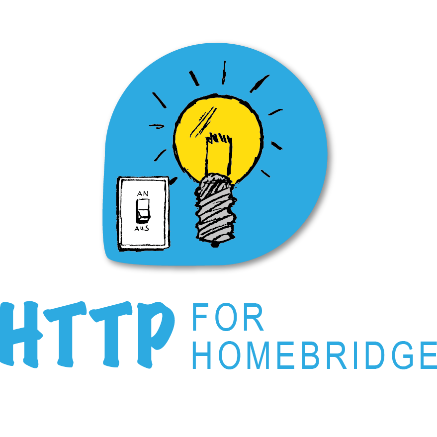

 

# Homebridge Plugin for HTTP based lights and switches

This is a Homebridge platform plugin and can be used to incorporate HTTP based lights and switches. The plugin supports any number of switches

## Configuration

The plugin assumes that your lights and switches exposes three URLs:
- Status - this url returns the status of your light or switch
- Turn light on - this url turns your light on 
- Turn light off

# Getting started

1. Install the plugin by searching for "awesome http"
2. Make sure you noted down the URLs as stated above for at least one light
3. Click on "Settings"
4. Fill in the General section with name, base url. Please follow and note the explanation below the fields
5. Add your first light
6. Name - Give it a nice name this is the name in homekit
7. HTTP Method -  if you don't know leave GET maybe POST
8. HTTP Content Type - application/text or application/json or quite common
9. Status URL - add the status URL - be aware that the status URL is prepended with the base url from above
9a. what the heck is a base url - you may safely ignore it (leave it empty) the status url alone is enough
10. add the turn on url - see 9 and 9a
11. add the turn off url - see 9 and 9a
12. click save
13. since we use a static platform, you need to restart homebridge (top right corner)
13. head over to the accessories pages

## Limitations

- HTTPS supported (untested)
- other settings than my playground

# Example

I use it to control the 5 lights of the crib my daughter built. 
The lights are controlled by an ESP8266 with a WebServer running on it.
The ESP8266 exposes an rest like  API, for each of the lights.
E.g. for the fire in front of the crib
- Status - http://crib.local/fire/left
- Turn On - http://crib.local/fire/left/on
- Turn Off - http://crib.local/fire/left/off

Pictures coming soon...